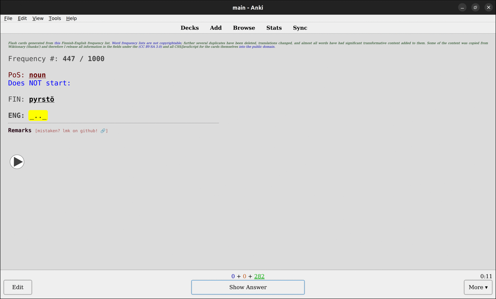

# [🔗 BIG ANKIWEB DOWNLOAD LINK](https://ankiweb.net/shared/info/1331009943)

## [🔗 Smaller, direct download link, from GitHub's "Releases" (`.apkg`) (`v3.0.0`)](https://github.com/hiAndrewQuinn/finfreq/releases/download/v3.0.0/finfreq_2022_07.apkg)

You need the [Anki flashcard program](https://apps.ankiweb.net/) to run this flashcard deck. For the uninitiated, Anki shows you flashcards only just before it thinks you'll forget them, so you don't have to do 2000 every single day. You'll see them less and less as you get them right over and over again.

If you're more technically inclined you can also download and import from this very repository using [CrowdAnki](https://github.com/Stvad/CrowdAnki). *Instructions on how to do this are [near the bottom](https://github.com/hiAndrewQuinn/finfreq#installation-using-crowdanki).*

# Features and Notes

- _New to v3!_ **Tatoeba example sentences** which by default are placed in the right column. You can edit the CSS to turn it back into a one-column affair if you wish.
- _New to v3!_ **Wiktionary information dumps** so you can read up on the deep lore of each individual word at your leisure.
- _New to v2!_ **Automatically playing MP3 clips of all words, no special setup.** Now you can study on the bus without even needing to look down! [See it in action here, on Windows.](https://www.veed.io/view/92ad9213-f98d-40da-9b7f-27e111bd0b94)
- **1 word in, 1 word out.** With rare exceptions, every word in Finnish gets _one_ word in English you are prompted to remember.
- **Consonant and vowel clues.** A small amount of JavaScript puts periods `.` in for _vowels_, and underscores `_` for _consonants_. This was by far the best thing I added when I was running through the deck myself!
  - ⚠️ WARNING: Not yet supported on AnkiDroid, and I have no plans to make it so. If you're studying on the go, consider it an extra challenge!
- **Handwritten remarks on most cards.** Because 1 word in, 1 word out isn't the best for learning the _vibe_ of a new word.
- **Emoji. Lots of emoji.** Usually related to the meaning of the card in question to help new learners have a small visual clue as well. 💝💖💝💖💝💖💝💖
- **Automatic hyperlinks.**
  - `Part of speech` links to the (English) Wikipedia entry.
  - `Word in Finnish` links to [SuomiEnglantiSanakirja.fi](https://www.suomienglantisanakirja.fi/), a quick bidirectional dictionary.
  - Automatic links at the bottom to [Wiktionary](https://en.wiktionary.org/wiki/Wiktionary:Main_Page) (one-directional, more detailed dictionary), [Tatoeba](https://tatoeba.org/en/) (a hand-checked repository of example sentences containing specific words), and [Uusi Kielemme](https://uusikielemme.fi/) (excellent grammar site and labor of love by someone with a real passion for Finnish).

# When should I try this deck out?

There are a few ways to answer this!

One good answer is **now**, just dive in. Another is **never**, because you should meet the most frequently used words anyway just by reading and immersing yourself in the language.

I say you should start **around the time you leave A1**. That is to say after you've worked through your first textbook in Finnish, or maybe your first semester of classes. It might be efficient to try to grind out the top 1000 (2000, 3000...) words in flashcard form, but it sure isn't _fun_ - I can tell you that firsthand.

That being said, the deck is split up into subdecks of:

- `Frequency 0001 - 0010`
- `Frequency 0011 - 0100`
- `Frequency 0101 - 0300`
- `Frequency 0301 - 0600`
- `Frequency 0601 - 1000`

So a final answer I might give is: **Do the first two decks / top 100 most common words _now_, and do the rest at your leisure**. [Zipf's law of vocabulary frequency](https://www.wikiwand.com/en/Zipf%27s_law#/overview) suggests that over a third of the words used in practice are in the _top 100_ words, and that's something you could definitely grind through in a weekend or two if you have any previous knowledge of the language.

I myself started work on this around the time I breached the A2 level of learning Finnish. A few months after completing the Finnish Duolingo course and starting to branch out to reading [YLE Uutiset Selkosuomeksi](https://yle.fi/uutiset/osasto/selkouutiset/) (free for all to read) and watching [dubbed _Peppa Pig_ on YLE's children network](https://areena.yle.fi/lapset/) (⚠️: regionlocked to only Finnish IP addresses).

# Installation using CrowdAnki

_Technically inclined only. You don't have to do it this way!_

1. **Install CrowdAnki** if it isn't already installed, either from [https://ankiweb.net/shared/info/1788670778](https://ankiweb.net/shared/info/1788670778), or by opening Anki and going to `Tools > Add-ons (Ctrl+Shift+A) > Get Add-Ons...` and pasting in the code `1788670778`.
2. **Restart Anki** if you just installed CrowdAnki.
3. `File > CrowdAnki: Import git repository`, and then **paste in the URL of this repository**:

   `https://github.com/hiAndrewQuinn/finfreq`

4. If you see a screen like this and don't know what to do, **just hit "OK"**:

   

   What this screen is asking is just whether you want to overwrite any default fields that already exist. If you're downloading this via CrowdAnki, I assume you want the absolute latest cutting-edge version and so you should leave all the "Personal Fields" unchecked so they can have their content overwritten with new stuff in case they've been updated since the last time you may have installed them.

5. If you see a screen like this and don't know what to do, again, **just hit "OK"**:

   

   This screen might pop up if the note type has been altered. For example, `v1` of this deck didn't hae any audio in it, but `v2` did, and this screen might pop up if you've already imported the deck on an earlier major release.
   - ⚠️ **I take no responsibility for what, if anything, happens to your card scheduling if this screen pops up.** I don't _think_ anything happens but I can't be certain until someone else tries it and reports back.
   
     If you're scared, hit "Cancel" and keep using your original earlier-version deck. Or test it yourself: Take your earlier deck and `.apkg` export it _with_ scheduling information; make a new profile and import it in there; and then overwrite _that_ to see whether the scheduling information is kept the same.

6. You should now see `finfreq` installed. On my system, every time I do this, it installs as a subdeck of `Default`:
   
   

   

# This is excellent! How can I donate?

I don't accept donations! But [Uusi Kielemme](https://uusikielemme.fi/category/support-me) does and they deserve every _sentti_. 🪙
